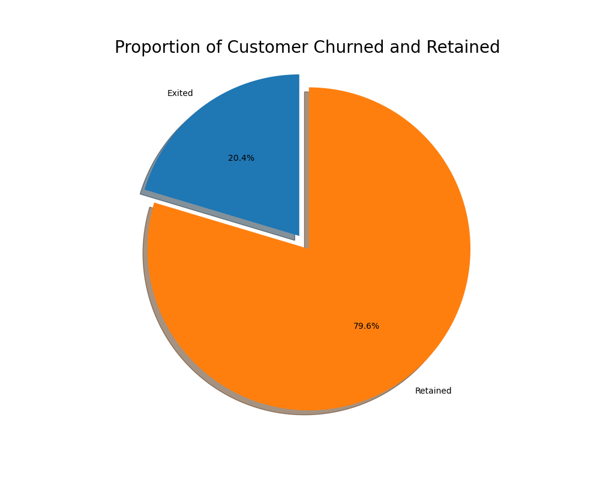
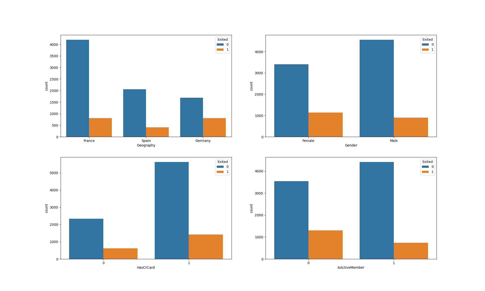
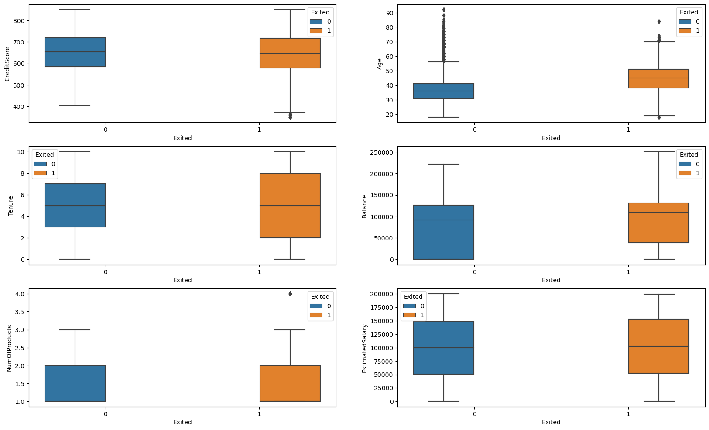
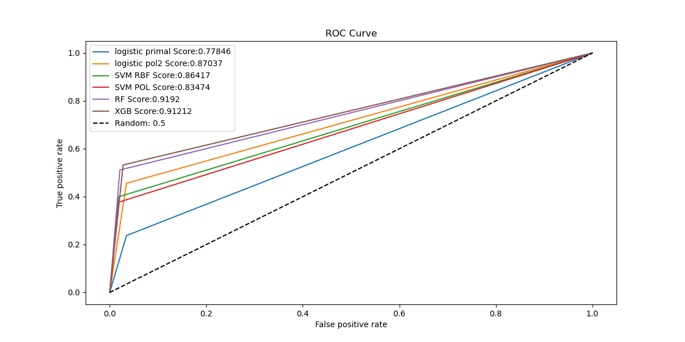
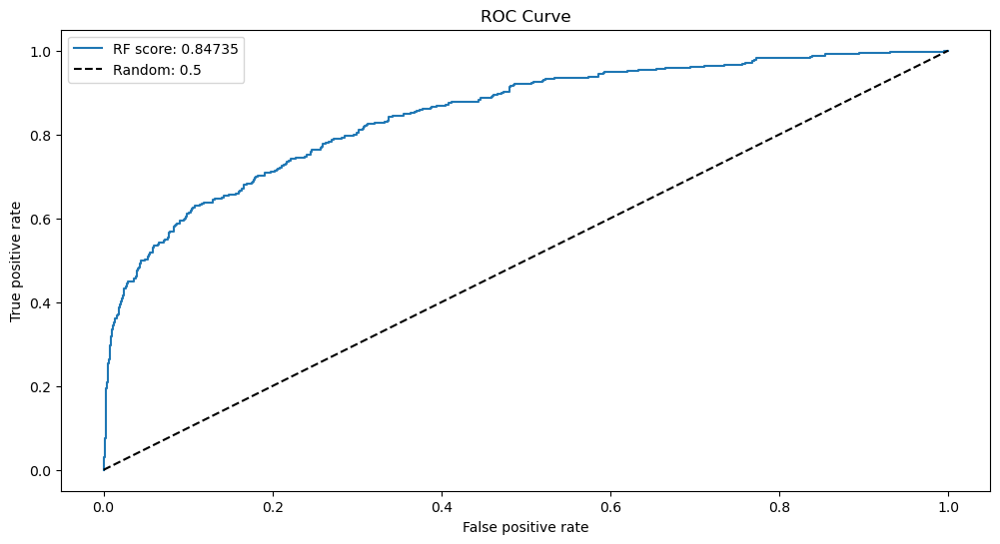

# Bank Customer Churn Prediction

The project aims to proactively identify customers who are likely to leave the bank. By predicting customer churn, the bank can implement targeted retention strategies, reduce customer acquisition costs, improve the customer experience, gain a competitive advantage, optimize business strategies, and positively impact profitability. Ultimately, the project aims to enhance customer retention, loyalty, and long-term growth for the bank.

## 1. Project Goal

We aim to accomplish the following goals:

- Identify the key drivers of customer churn at the bank
- Build a predictive model that will perform the following:
    1. Classifiy if a customer is going to churn or not
    2. Ideally, select a model that can assign a churn probability to customers, making it more convenient for customer service to focus on easily manageable cases to prevent churn. This way, they can prioritize efforts towards retaining customers who are most likely to churn based on the model's performance.

## 2. Data Set Review

Key finding from the data set review:

    - The data set has 1000 rows with 14 attributes.
    - The data set has no missing values.
    - The first 2 attributes which are RowNumber and CustomerId are not useful for the analysis and will be dropped.
    - The target variable is Exited.

Hypothesis questions after reviewing dataset:

1. The available data seems to capture a specific moment in time, as indicated by attributes like the balance associated with a given date. However, this raises several inquiries:
        
        . What date is it and of what relevance is this date?
        . Would it be possible to obtain balances over a period of time as opposed to a single date?

2. There are customers who have exited but still have a balance. What is the reason for this? Could they have exited  from a product and not the bank?
3. What does being an active member mean and are there difference degree to it? Could it be better to provide transaction count both in terms of credits and debits to the account instead?
4. A break down to the products bought into by a customer could provide more inforamtion topping listing of product count

## 3. Exploratory Data Analysis

Approximately 20% of the customer base has churned, meaning they have discontinued their relationship with the bank. As a baseline model, it would be reasonable to predict that 20% of the customers will churn. Since this percentage represents a relatively small portion of the total customer base, it is crucial to select a model that can accurately identify this 20% with high precision. The bank's primary focus is on identifying and retaining this particular group of customers rather than accurately predicting the customers who remain with the bank.

Based on the information provided, we have observed the following:

1. The majority of the customers who churned are from France. However, there is an inverse relationship between the proportion of churned customers and the population of customers in certain areas. This suggests that the bank may have a problem in regions with fewer clients, possibly due to inadequate customer service resources allocated.

2. Female customers have a higher proportion of churn compared to male customers

3. There is a significant number of customers who churned have credit cards. It is worth noting that a large majority of the overall customer base also possesses credit cards, so this correlation may be coincidental.

4. The proportion of churned customers is higher among inactive members. This raises concerns as the overall proportion of inactive members is already quite substantial. Implementing a program to convert these inactive customers into active ones could greatly reduce churn and have a positive impact on customer retention.

We have observed the following:

1. There is no significant variation in the distribution of credit scores between customers who have stayed with the bank and those who have churned.

2. Older customers are more likely to churn compared to younger customers, suggesting a possible difference in service preferences across age groups. The bank may need to reassess its target market or review retention strategies tailored to different age categories.

3. Customers at the extremes of tenure (either very short or very long) are more likely to churn compared to those with an average tenure.

4. Concerningly, the bank is losing customers with substantial bank balances, which could impact their available capital for lending.

5. Neither the product nor the salary has a significant impact on the likelihood of customer churn.

## 4. Review Best Model Performance

| Model | Accuracy | Precision | Recall | F1-Score | ROC |
| --- | --- | --- | --- | --- | --- |
| Primal Logistic Regression | 0.82 | 0.64 | 0.24 | 0.35 | 0.78 |
| Logistic Regression with Pol 2 Kernel| 0.86 | 0.77 | 0.46 | 0.57 | 0.87 |
| SVM with RBF Kernel| 0.86 | 0.85 | 0.40 | 0.54 | 0.86 |
| SVM with pol Kernel| 0.86 | 0.84 | 0.38 | 0.52| 0.83 |
| Random Forest Classifier| 0.89 | 0.88| 0.53 | 0.66 | 0.92 |
| XGBoost Classifier| 0.88 | 0.83 | 0.53 | 0.65|  0.91 |

Based on the above finding, the primary project is to predict potential churn  customers and implement measures to prevent churn. Therefore, the accuracy of correctly identifying customers who may churn (recall on the positive cases) is more important than the overall accuracy score of the model.

Given that only 20% of the data represents churn cases, achieving a recall higher than this baseline would already be an improvement. However, our goal is to maximize the recall while maintaining a high precision. This way, the bank can efficiently allocate its resources towards the customers identified by the model without wasting too many resources on false positives.

Upon reviewing the fitted models, the random forest model stands out as it provides a reasonable balance between recall and precision. Based on the training set, this model has a precision score of 0.88 on churn cases, meaning that out of all the customers predicted to churn, 88% actually do. Additionally, it achieves a recall score of 0.53 on churn cases, successfully highlighting 53% of all customers who churned.

## 5. Test Model Prediction Accuracy on Test Data

Primal Logistic Regression:

| | Precision | Recall | F1-Score | Support |
| --- | --- | --- | --- | --- |
| 0 | 0.84 | 0.96 | 0.90 | 1610 |
| 1 | 0.62 | 0.24 | 0.34 | 390 |
| Accuracy | | | 0.82 | 2000 |
| Macro avg | 0.73 | 0.60 | 0.62 | 2000 |
| Weighted avg | 0.80 | 0.82 | 0.79 | 2000 |

## 6. Conclusion

The model shows a slightly improved precision in predicting churned customers (label 1) when tested on unseen data. However, despite its overall high accuracy, the model still fails to identify approximately half of the customers who actually churn. To enhance its performance, it would be beneficial to continuously retrain the model using additional data over time. In the meantime, utilizing the current model can help save around 41% of customers who would have otherwise churned.